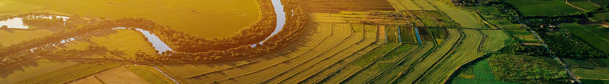

## Salut, Ciao, Hola, Hallo, Hello

I am WebbMaps. A GIS enthusiast attempting to stay as anonymous as possible in this day and age.

I'm a GIS graduate with a minor in Geospatial Intelligence, highly interested in maps, spatial data, and the stories they tell.

## 🧭 About Me
- 🎓 Background in Geographic Information Systems (GIS) & Geospatial Intelligence  
- 🛰️ Strong interest in spatial data management and geospatial analysis  
- 💻 Enjoy coding for GIS workflows and automation  
- 🚁 FAA Part 107 certified drone pilot (drone mapping & imagery)  
- 🌍 Interested in anthropogenic change detection and how human activity reshapes landscapes  
- 🌪️ Fascinated by natural events and spatial analysis for understanding their impact  
- 📚 Lifelong Learner. I’m always looking for MOOCs and free GIS courses to keep building and sharpening my skills.

## 🔍 Interests
- Change detection & temporal analysis  
- Remote sensing & imagery interpretation  
- Drone mapping and photogrammetry  
- Natural event analysis & response mapping  
- Data creation and geospatial workflows  

## 🛠️ Tools & Technologies
- ArcGIS / QGIS  
- Python (GeoPandas, Rasterio, Leafmap, Google Earth Engine)  
- Remote sensing tools  
- GPS & drone data processing software  

## 🤝 Contact
Want to collaborate, see my work, or share data? Reach out here.  
CHEERS
